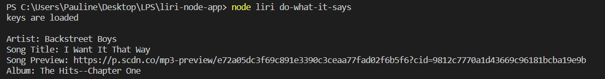

# LIRI

LIRI is like iPhone's SIRI. However, while SIRI is a Speech Interpretation and Recognition Interface, LIRI is a _Language_ Interpretation and Recognition Interface. LIRI is a command line node app that takes in parameters and gives you back data.

### Overview

1. LIRI will search Spotify for songs, Bands in Town for concerts, and OMDB for movies.

2. To retrieve the data that will power this app, requests are sent to the Bands in Town, Spotify and OMDB APIs.

   * [Node-Spotify-API](https://www.npmjs.com/package/node-spotify-api)

   * [Request](https://www.npmjs.com/package/request) (axios used in this case)

     * Used to grab data from the [OMDB API](http://www.omdbapi.com) and the [Bands In Town API](http://www.artists.bandsintown.com/bandsintown-api)

   * [Moment](https://www.npmjs.com/package/moment)

   * [DotEnv](https://www.npmjs.com/package/dotenv)

3. In addition to logging the data to the terminal/bash window, the commands and data are appended to a .txt file called `log.txt`.

### What Each Command Does

1. `node liri.js concert-this <artist/band name here>`

   * This will search the Bands in Town Artist Events API (`"https://rest.bandsintown.com/artists/" + artist + "/events?app_id=codingbootcamp"`) for an artist and render the following information about each event to the terminal & log.txt:

     * Name of the venue

     * Venue location

     * Date of the Event (formatted as"MM/DD/YYYY")

  Examples:

  
  

  Defaults to search for Boyz II Men:

  
  


2. `node liri.js spotify-this-song '<song name here>'`

   * This will show the following information about the song in the terminal/bash window

     * Artist(s)

     * The song's name

     * A preview link of the song from Spotify

     * The album that the song is from

  Example:

  
  
   * If no song is provided then search will default to "The Sign" by Ace of Base.

  
  

3. `node liri.js movie-this '<movie name here>'`

   * This will output the following information to the terminal/bash window:

     ```
       * Title of the movie.
       * Year the movie came out.
       * IMDB Rating of the movie.
       * Rotten Tomatoes Rating of the movie.
       * Country where the movie was produced.
       * Language of the movie.
       * Plot of the movie.
       * Actors in the movie.
     ```
   
   Example:
   
   

   * If the user doesn't type a movie in, the program will output data for the movie 'Mr. Nobody.'

   

4. `node liri.js do-what-it-says`

   * Using the `fs` Node package, LIRI will take the text inside of random.txt and then use it to call one of LIRI's commands.

     * It should run `spotify-this-song` for "I Want it That Way," as follows the text in `random.txt`.

     * Edit the text in random.txt to test out the feature for movie-this and my-tweets

  
  